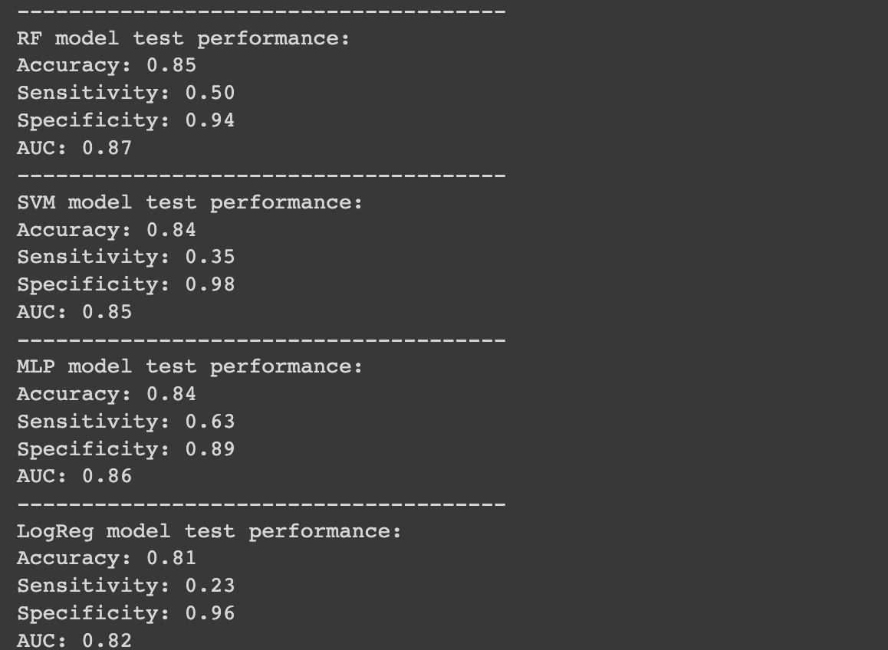
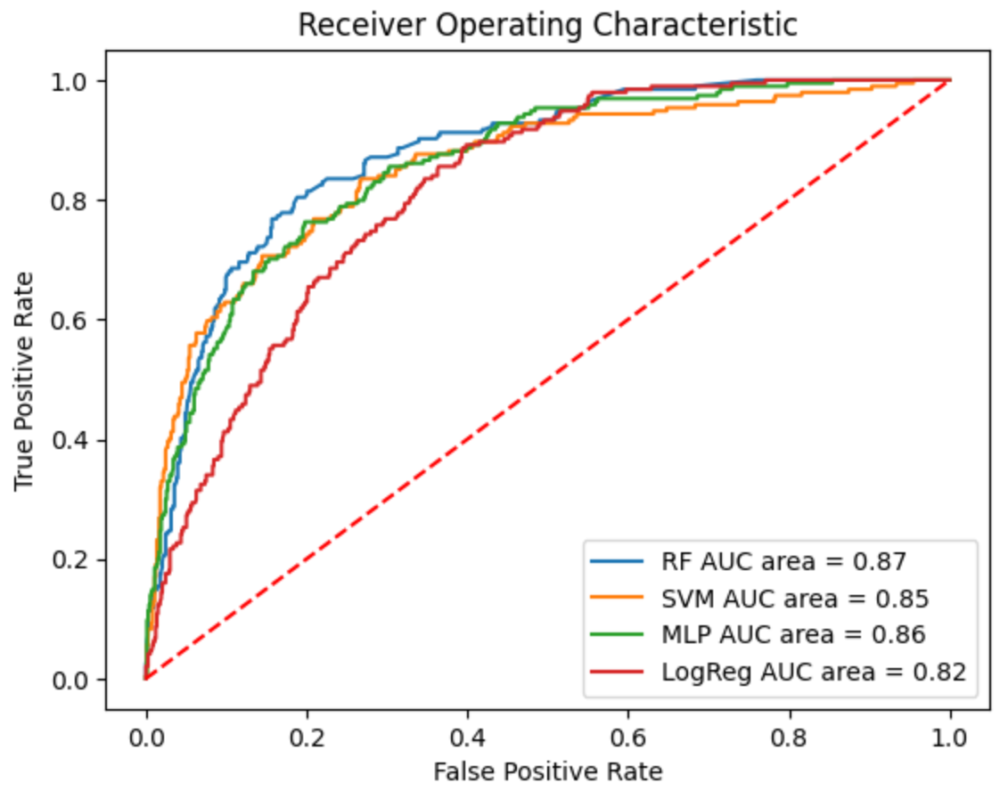

# Predicting potency value (pIC50) for compounds targeting EGFR

## Train and Predict
The PotencyPredictor class provides methods to load data, encode molecules, train a model, predict, and evaluate.

The model options are:
- Logistic Regression: "LogReg"
- Support Vector Machine: "SVM"
- Random Forest: "RF"
- Multi-Layer Perceptron: "MLP"

Users can define the parameters of each model and pass it to the PotencyPredictor.train(args) method. 

The inference method allows users to choose a trained model, and perform inference on a new dataset (data and corresponding labels).

## Evaluate 
The performance of the model can be evaluated on accuracy, sensitivity, specificity as well as area under curve (AUC) metrics. 

